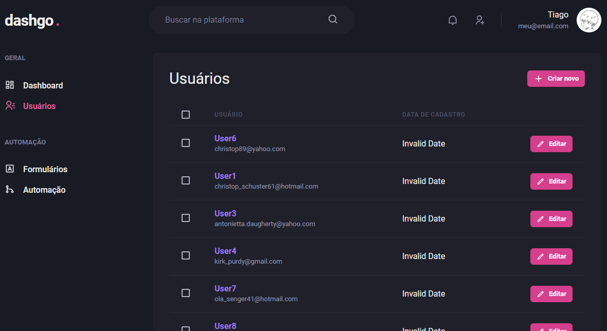

<h1 align="center">
  dashgo<span style="color: #D53F8C;">.</span>
</h1>

<h1 align="center">
  
</h1>

## O projeto

Dashboard.

## Tecnologias

- [ReactJS](https://reactjs.org/)
- [NextJS](https://nextjs.org/)
- [TypeScript](https://www.typescriptlang.org/)
- [Chakra-ui](https://chakra-ui.com/)
- [React Hook Form](https://react-hook-form.com/)
- [Yup](https://github.com/jquense/yup)
- [MirageJS](https://miragejs.com/)

## Configurações necessárias
### **Clone do projeto**

```bash
# Execute o comando git clone para realizar o clone do repositório
$ git clone https://github.com/gonribeiro/Rocketseat.git
# Entre na pasta do repositório clonado
$ cd NLW-Rocketseat\IGNITE-Dashgo
```

### **Iniciando o projeto**

```bash
# Execute yarn para instalar as dependências
$ yarn

# Para iniciar a aplicação
$ yarn dev

# Acesse:
http://localhost:3000/users

```