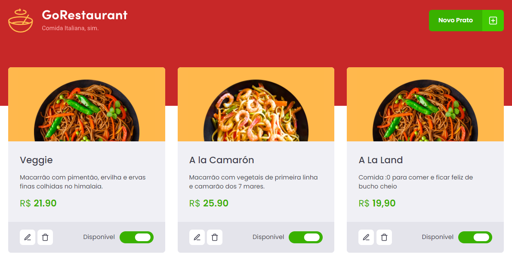

<p align="center">
  

  

  
</p>

<h1 align="center">
  
  <br />
  <br />
  
</h1>

# 🧪 Tecnologias

Tecnologias utilizadas para construção da aplicação:

- [React.js](https://reactjs.org/)
- [TypeScript](https://www.typescriptlang.org/)
- [React Icons](https://react-icons.github.io/react-icons/)
- [React Modal](https://github.com/reactjs/react-modal)
- [Styled Components](https://styled-components.com)
- [Axios](https://github.com/axios/axios)

# 🚀 Iniciando o projeto:

Clone do projeto:

```bash
$ git clone https://github.com/gonribeiro/Rocketseat
$ cd Rocketseat\IGNITE-GoRestaurant
```

Iniciando o projeto:

```bash
# Instale as dependências
$ yarn

# Execute o back - http://localhost:3333
$ yarn server

# Execute o front - http://localhost:3000
$ yarn start
```
