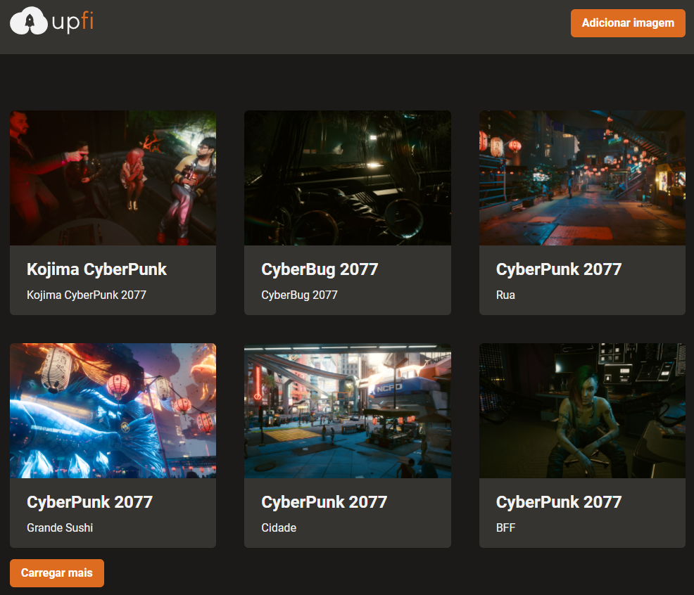

<h1 align="center">
    UpFi
</h1>

<p align="center">
  

  

  
</p>

<h1 align="center">
  
</h1>

# 🎮 O Projeto
Site de galeria de imagens.

# 🧪 Tecnologias

Tecnologias utilizadas para construção da aplicação:

- [React](https://reactjs.org/)
- [Typescript](https://www.typescriptlang.org/)
- [NextJS](https://nextjs.org/)
- [Chakra UI](https://chakra-ui.com/)
- [Axios](https://github.com/axios/axios)
- [FaunaDB](https://fauna.com/)
- [React Query](https://react-query.tanstack.com/)
- [React Icons](https://react-icons.github.io/react-icons/)
- [React Hook Form](https://react-hook-form.com/)
- [ESLint](https://eslint.org/)
- [Prettier](https://prettier.io/)
- [Jest](https://jestjs.io/pt-BR/)
- [ImgBB](https://imgbb.com/)

# 🚀 Iniciando o projeto:

## Requisitos

Criar conta e configurar os serviços externos:

- [FaunaDB](https://fauna.com/)
- [ImgBB](https://imgbb.com/)

Clone do projeto:

```bash
$ git clone https://github.com/gonribeiro/Rocketseat
$ cd Rocketseat\IGNITE-Upfi
```

Iniciando o projeto:

```bash
# Instalar as dependências
$ yarn

# Na raiz do projeto crie uma copia do arquivo .env.local.example
# Altere o nome da copia para .env.local
# Preencha as variáveis ambiente de acordo com as instruções

# Inicie o projeto
$ yarn dev
```